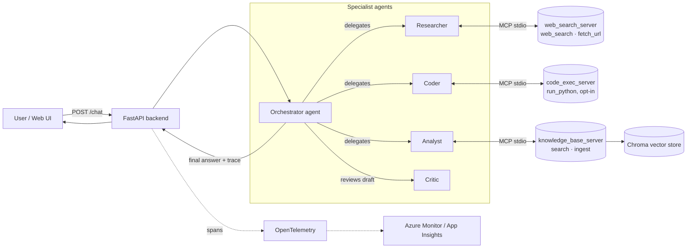

# 🤖 Agentic Research Platform

A production-shaped **multi-agent AI system**: a lead orchestrator coordinates specialist
agents (Researcher, Coder, Analyst, Critic) that call out to custom **Model Context Protocol
(MCP)** tool servers, ground answers with **RAG**, and report through full **OpenTelemetry**
observability — all built on **Microsoft Agent Framework** (the 2025/2026 successor to
Semantic Kernel + AutoGen) and deployable to **Azure Container Apps** with a single `azd up`.

> Built as a portfolio project to demonstrate the agentic-AI engineering skills employers are
> hiring for in 2026/2027: multi-agent orchestration, MCP tooling, RAG, evals, observability,
> and cloud-native deployment — not just "call an LLM API."

## Architecture



**Orchestration pattern:** a Magentic-One-style manager loop. The Orchestrator agent looks at
the task and the running transcript, picks exactly one specialist to invoke next (JSON
contract), and routes its own draft answer through the Critic once for a reflection pass before
returning `FINAL`. The loop is a small, fully testable Python function — not a black box — so
its behavior is easy to explain in an interview.

## Why this stands out on a resume

- **Microsoft Agent Framework** — the actively-developed unification of Semantic Kernel +
  AutoGen (GA 2025). Shows you're current with where Microsoft's agent stack is *actually*
  heading, not just building a LangChain toy.
- **Model Context Protocol (MCP)** — three custom MCP servers (web research, code execution,
  knowledge base) built with the official MCP Python SDK. MCP is the emerging standard for
  tool/agent interop across vendors.
- **Multi-agent orchestration with reflection** — planner/specialist/critic loop, not a single
  prompt-and-pray chatbot.
- **RAG** — Chroma vector store + chunking + retrieval, swappable for Azure AI Search.
- **Observability** — OpenTelemetry spans for every agent/tool/MCP call, exportable to Azure
  Monitor.
- **Evals** — an automated eval harness (`evals/run_evals.py`) that grades the agent team
  against a task dataset, runnable in CI.
- **Security-conscious by design** — SSRF-guarded URL fetching, opt-in (disabled by default)
  code execution with a minimal-privilege subprocess sandbox, scoped CORS, secrets in Key Vault
  — called out explicitly rather than glossed over.
- **Real cloud deployment** — Dockerfile + `azd`-compatible Bicep for Azure Container Apps,
  plus GitHub Actions CI and an optional federated-identity CD pipeline.

## Project structure

```
src/agentic_platform/
  config.py             # provider-agnostic model client factory (Azure OpenAI / Foundry / OpenAI)
  telemetry.py           # OpenTelemetry exporter wiring
  agents/
    orchestrator.py       # the Magentic-style manager loop + AgentTeam lifecycle
    prompts.py            # system prompts for each agent
  mcp_servers/
    web_search_server.py  # web_search, fetch_url (SSRF-guarded)
    code_exec_server.py    # run_python (opt-in, sandboxed subprocess)
    knowledge_base_server.py # search_knowledge_base, ingest_text
  rag/
    vector_store.py        # Chroma-backed chunk/embed/search
  api/
    main.py                 # FastAPI app: /health, /chat, static web UI
  evals/
    dataset.json / run_evals.py
web/                        # vanilla HTML/JS chat UI with an "agent trace" panel
infra/                       # azd-compatible Bicep (Container Apps, ACR, Key Vault, App Insights)
tests/                        # pytest suite (no API keys required)
```

## Quick start (local)

**Prerequisites:** Python 3.11+, an OpenAI-compatible API key (OpenAI, Azure OpenAI, or
Microsoft Foundry).

```powershell
python -m venv .venv
.venv\Scripts\Activate.ps1
pip install -e .[dev]
# using Microsoft Foundry instead of OpenAI/Azure OpenAI? also: pip install -e .[foundry]

copy .env.example .env
# edit .env and set OPENAI_API_KEY (or AZURE_OPENAI_* / FOUNDRY_*)

uvicorn agentic_platform.api.main:app --reload
```

> **Why not `pip install agent-framework`?** That meta-package pulls in every provider
> integration (Redis, Gemini, Mistral, a 100+MB Claude Agent SDK, a WASM sandbox, ...) and can
> make pip's resolver spend many minutes backtracking. This project depends on the scoped
> `agent-framework-core` package instead (OpenAI + Azure OpenAI included), plus the optional
> `agent-framework-foundry` extra only if you use Microsoft Foundry.

Open http://localhost:8000 for the chat UI, or call the API directly:

```powershell
curl -X POST http://localhost:8000/chat -H "Content-Type: application/json" -d "{\"message\": \"What is Microsoft Agent Framework?\"}"
```

### Ingest documents for RAG

Drop `.txt`/`.md` files into `data/docs/`, then:

```powershell
python scripts/ingest_docs.py
```

Ask the Analyst agent about them through the chat UI — it will ground its answer in the
retrieved chunks, or say plainly when nothing relevant was found.

### Run the eval suite

```powershell
python -m agentic_platform.evals.run_evals
```

### Run tests

```powershell
pytest -v
```

## Deploying to Azure

```powershell
azd auth login
azd up
```

This provisions Log Analytics, Application Insights, a Key Vault (for your model API key),
Azure Container Registry, a Container Apps Environment, and a Container App — then builds and
deploys this repo's Dockerfile to it. Push to `main` after running `azd pipeline config` to
enable the included CI/CD workflow.

## Security notes

- **`fetch_url`** resolves and validates hostnames before fetching, rejecting loopback,
  private, link-local, and reserved IP ranges to mitigate SSRF (e.g. cloud metadata endpoint
  probing).
- **`run_python`** is **disabled by default** (`ENABLE_CODE_EXECUTION=false`). If enabled for a
  demo, it runs in a subprocess with a stripped environment (no secrets forwarded), a temp
  working directory, and a hard timeout — a convenience sandbox, *not* a security boundary. For
  production, replace it with a real isolation layer such as Azure Container Apps dynamic
  sessions.
- **CORS** is restricted to `ALLOWED_ORIGINS` (defaults to localhost only).
- **Secrets** (model API keys) are stored in Key Vault and referenced by the Container App via
  managed identity, never baked into the image.

## Roadmap / extension ideas

- Swap Chroma for Azure AI Search (hybrid + semantic ranking) for production-scale RAG.
- Replace the hand-rolled orchestration loop with Agent Framework's built-in
  `WorkflowBuilder` Magentic orchestration once you've validated the exact API surface for your
  installed version.
- Stream responses over Server-Sent Events for token-by-token UI updates.
- Add human-in-the-loop tool approval for the Coder agent.
- Add an LLM-as-judge rubric to `evals/run_evals.py` for nuanced quality scoring.

## Resume bullet ideas

- *Designed and built a multi-agent AI research assistant on Microsoft Agent Framework with a
  reflection-based orchestration loop, three custom MCP tool servers, and Chroma-backed RAG.*
- *Implemented an automated eval harness and OpenTelemetry/Azure Monitor observability pipeline
  for a multi-agent system; deployed via Docker + Bicep to Azure Container Apps with CI/CD.*
- *Hardened an agentic tool-calling surface against SSRF and arbitrary code execution risks
  with hostname validation, opt-in sandboxing, and least-privilege secret handling.*

## License

MIT — see [LICENSE](LICENSE).
